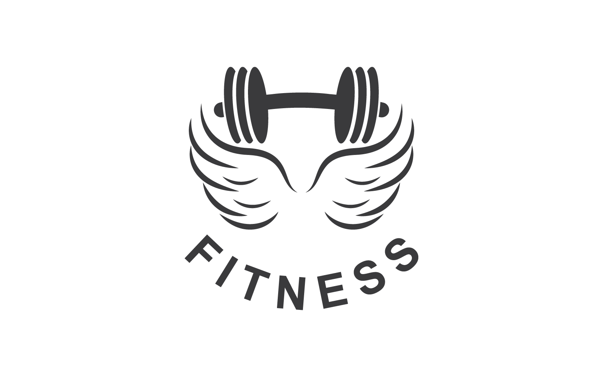

# Iniciativa Bootstrap
> C riaçâo de uma página usando o Bootstrap 5.3.7

### Projeto

##### Links de referência :ok_hand:

Carrousel: [link referência](https://getbootstrap.com/docs/5.3/components/carousel/ )

**Autoplaying carousels #**
> Modificações nescessárias feitas *


```ruby
<div id="carouselExampleAutoplaying" class="carousel slide" data-bs-ride="carousel">
            <div class="carousel-inner">
                <div class="carousel-item active">
                    
                </div>
                <div class="carousel-item">
                    
                </div>
                <div class="carousel-item">
                    
                </div>
            </div>
            <button class="carousel-control-prev" type="button" data-bs-target="#carouselExampleAutoplaying" data-bs-slide="prev">
                <span class="carousel-control-prev-icon" aria-hidden="true"></span>
                <span class="visually-hidden">Previous</span>
            </button>
            <button class="carousel-control-next" type="button" data-bs-target="#carouselExampleAutoplaying" data-bs-slide="next">
                <span class="carousel-control-next-icon" aria-hidden="true"></span>
                <span class="visually-hidden">Next</span>
            </button>
        </div>
```

---

Navbar: [link referência](https://getbootstrap.com/docs/5.0/components/navbar/#supported-content)

**Text #**
> Modificações nescessárias feitas *


```ruby
        <nav class="navbar navbar-expand-lg bg-body-tertiary ">
            <div class="container-fluid ">
              <button class="navbar-toggler" type="button" data-bs-toggle="collapse" data-bs-target="#navbarTogglerDemo01" aria-controls="navbarTogglerDemo01" aria-expanded="false" aria-label="Toggle navigation">
                <span class="navbar-toggler-icon"></span>
              </button>
              <div class="collapse navbar-collapse " id="navbarTogglerDemo01">
                
                <ul class="navbar-nav me-auto mb-Segunda-feira	 mb-lg-0 ">
                  <li class="nav-item btn btn-outline-secondary">
                    <card class="nav-link active " aria-current="page" href="#">Ver planos</card>
                  </li>
                  <li class="nav-item btn btn-outline-secondary">
                    <card class="nav-link active" aria-current="page" href="#">Fale conosco</card>
                  </li><li class="nav-item btn btn-outline-secondary">
                    <card class="nav-link active" aria-current="page" href="#">Cadastre-se</card>
                  </li>
                </ul>
                <form class="d-flex" role="search">
                  <input class="form-control me-Segunda-feira	" type="search" placeholder="Search" aria-label="Search"/>
                  <button class="btn btn-dark" type="submit">Procurar</button>
                </form>
              </div>
            </div>
          </nav>
```
---

Este código é usado me quase toda a página.

Button: [link referência](https://getbootstrap.com/docs/5.0/components/buttons/)

**Outline buttons #**
> Modificações nescessárias feitas *

Um exemplo:


```ruby
<button class="btn btn-dark" type="submit">Procurar</button>

```

---

tables: [link referência](https://getbootstrap.com/docs/5.0/content/tables/)

Overview #
> Modificações nescessárias feitas *


```ruby
            <table class="table table table-dark table-striped">
              <thead>
                <tr>
                  <th scope="col">Dias da semana</th>
                  <th scope="col">Treino</th>
                  <th scope="col">Grupo Muscular</th>
                </tr>
              </thead>
              <tbody>
                <tr>
                  <th scope="row">Segunda-feira	</th>
                  <td>Supino, Tríceps na polia</td>
                  <td>Peito e Tríceps</td>        
                </tr>
                <tr>
                  <tr>
                    <th scope="row">terça-feira	</th>
                    <td>Agachamento, Leg Press</td>
                    <td>Pernas e Glúteos</td>
                  </tr>
                  <tr>
                    <th scope="row">Quarta-feira</th>
                    <td>Remada curvada, Pulldown</td>
                    <td>Costas e Bíceps</td>                
                  </tr>
                  <tr>
                    <th scope="row">Quinta-feira	</th>
                  <td>Desenvolvimento, Elevação lateral</td>
                  <td>Ombros</td>              
                </tr>
                <tr>
                  <th scope="row">Sexta-feira	</th>
                  <td>Stiff, Afundo com halteres</td>
                  <td>Posterior de Coxa e Glúteos</td>              
                </tr>
                <th scope="row">Sábado</th>
                <td>HIIT, Abdominais</td>
                <td>Cardio e Core</td>
              </tr>
              </tbody>
            </table>
```

----
#### Link do trabalho 	:ghost: :skull:
[ACADEMIA](https://brian-loop.github.io/Iniciativa_Bootstrap/)     <--

Projeto começado dia 17/06 as 8:30 am

### Projeto ainda não finalizado...